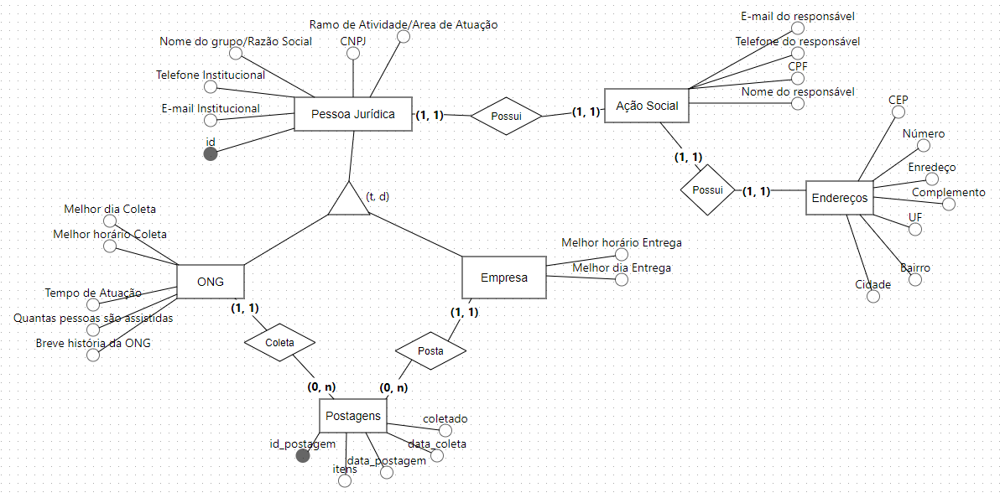
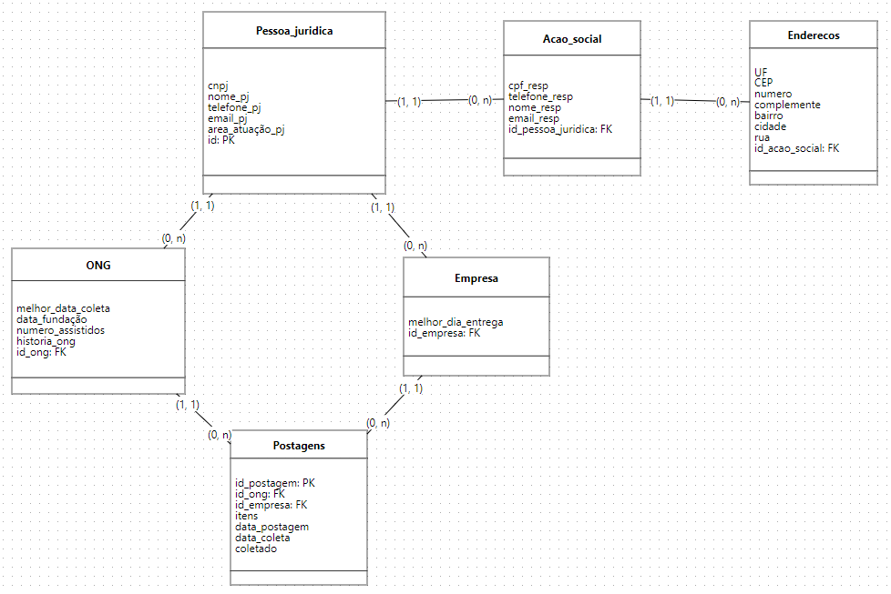

# Documentação do Banco de Dados

Documentação da database RedeAlimenta. O objetivo dessa database é armazenar os dados dos contribuidores do projeto (ONGs e empresas), seus responsáveis pelo projeto e contribuições feitas.

## Modelos

### Conceitual

### Lógico

## Tabelas

### 1. Pessoa_juridica

Informações relacionadas a parte jurídica da empresa ou ONG. As entidades ONG e Empresa são derivadas dessa. Principal chave primaria da database.

| Coluna          | Tipo         | Restrições  |
| --------------- | ------------ | ----------- |
| cnpj            | VARCHAR(18)  | NOT NULL    |
| nome_pj         | VARCHAR(255) | NOT NULL    |
| telefone_pj     | VARCHAR(14)  | NOT NULL    |
| email_pj        | VARCHAR(100) | NOT NULL    |
| area_atuação_pj | TEXT         |             |
| id              | SERIAL       | PRIMARY KEY |

### 2. ONG

Especialização da entidade **Pessoa_juridica** para descrever uma entidade ONG. A chave estrangeira _id_ong_ faz referencia a chave primária _id_ da tabela **Pessoa_juridica**. Ela é única nessa tabela e também na tabela **Empresa**.

| Coluna             | Tipo      | Restrições                                          |
| ------------------ | --------- | --------------------------------------------------- |
| melhor_data_coleta | TIMESTAMP | WITH TIME ZONE                                      |
| data_fundacao      | DATE      | CHECK (data_fundacao <= CURRENT_DATE)               |
| numero_assistidos  | INT       | CHECK (numero_assistidos > 0)                       |
| historia_ong       | TEXT      |                                                     |
| id_ong             | INT       | FOREIGN KEY (id_ong) REFERENCES Pessoa_juridica(id) |

### 3. Empresa

Especialização da entidade **Pessoa_juridica** para descrever uma entidade Empresa. A chave estrangeira _id_empresa_ faz referencia a chave primária _id_ da tabela **Pessoa_juridica**. Ela é única nessa tabela e também na tabela **ONG**.

| Coluna             | Tipo      | Restrições                                              |
| ------------------ | --------- | ------------------------------------------------------- |
| melhor_dia_entrega | TIMESTAMP | WITH TIME ZONE                                          |
| id_empresa         | INT       | FOREIGN KEY (id_empresa) REFERENCES Pessoa_juridica(id) |

### 4. Acao_social

Descreve a pessoa responsável pela ação social ligada à entidade **Pessoa_juridica**. A chave estrangeira _id_pessoa_juridica_ faz referencia a chave primária _id_ da tabela **Pessoa_juridica**.

| Coluna             | Tipo         | Restrições                                                      |
| ------------------ | ------------ | --------------------------------------------------------------- |
| cpf_resp           | VARCHAR(14)  | NOT NULL                                                        |
| telefone_resp      | VARCHAR(14)  | NOT NULL                                                        |
| nome_resp          | VARCHAR(100) | NOT NULL                                                        |
| email_resp         | VARCHAR(100) | NOT NULL                                                        |
| id_pessoa_juridica | INT          | FOREIGN KEY (id_pessoa_juridica) REFERENCES Pessoa_juridica(id) |

### 5. Postagens

Descreve as postagens/coletas. A _id_postagem_ é a chave primária, as entidades ONG e Empresa são representadas pelas chaves estrangeiras _id_ong_ e _id_empresa_ respectivamente. A postagem é inserida pelo usuário empresas e deve conter as informações: lista de itens (_itens_) e data da coleta (_data_coleta_). Essas informações serão disponibilizadas para as ONGs cadastradas e, quando uma delas indicar que irá coletar a doação, a coluna _id_ong_ será preenchida. Caso a coleta seja efetuada, o booleano _coletado_ será marcado como 'yes'. Caso nenhuma ONG realize a coleta até a data _data_coleta_ o booleano será marcado como 'no' e a postagem não estará mais disponível.

| Coluna        | Tipo      | Restrições                                              |
| ------------- | --------- | ------------------------------------------------------- |
| id_postagem   | SERIAL    | PRIMARY KEY                                             |
| id_ong        | INT       | FOREIGN KEY (id_ong) REFERENCES ong(id_ong)             |
| id_empresa    | INT       | FOREIGN KEY (id_empresa) REFERENCES empresa(id_empresa) |
| itens         | TEXT[]    | NOT NULL                                                |
| data_postagem | TIMESTAMP | WITH TIME ZONE DEFAULT CURRENT_TIMESTAMP                |
| data_coleta   | TIMESTAMP | NOT NULL                                                |
| coletado      | BOOLEAN   | DEFAULT NULL CHECK (coletado IN ('yes, 'no', NULL))     |

Segundo essas informações, é possível definir os seguintes status

-   **Postagem em aberto:**
    -   Dados do usuário Empresa: id_empresa, itens, data_coleta;
    -   Dados automáticos: id_postagem, data_postagem, coletado = 'NULL'
-   **Postagem em aberto e aceita por uma ONG:**
    -   Dados do usuário Empresa: id_empresa, itens, data_coleta;
    -   Dados do usuário ONG: id_ong;
    -   Dados automáticos: id_postagem, data_postagem, coletado = 'NULL'
-   **Postagem fechada sem marcação de alguma ONG:**
    -   Dados do usuário Empresa: id_empresa, itens, data_coleta;
    -   Dados automáticos: id_postagem, data_postagem, coletado = 'no'
-   **Postagem fechada e coletada por uma ONG:**
    -   Dados do usuário Empresa: id_empresa, itens, data_coleta;
    -   Dados do usuário ONG: id_ong;
    -   Dados automáticos: id_postagem, data_postagem, coletado = 'yes'
-   **Postagem fechada com marcação pela ONG mas NÃO coletada pela ONG:**
    -   Dados do usuário Empresa: id_empresa, itens, data_coleta;
    -   Dados do usuário ONG: id_ong;
    -   Dados automáticos: id_postagem, data_postagem, coletado = 'no'

### 6. Enderecos

Descreve o endereço associado a entidade _Acao_social_.

| Coluna         | Tipo        | Restrições                                                  |
| -------------- | ----------- | ----------------------------------------------------------- |
| UF             | CHAR(2)     | NOT NULL                                                    |
| CEP            | VARCHAR(10) | NOT NULL                                                    |
| numero         | VARCHAR(20) |                                                             |
| complemento    | TEXT        |                                                             |
| bairro         | VARCHAR(50) | NOT NULL                                                    |
| cidade         | VARCHAR(50) | NOT NULL                                                    |
| rua            | VARCHAR(50) |                                                             |
| id_acao_social | INT         | FOREIGN KEY (id_acao_social) REFERENCES Pessoa_juridica(id) |

## Funções

### 1. verificar_pj_duplicado_empresa

-   **Propósito**: Evita que uma empresa e ONG tenham o mesmo ID de pessoa jurídica.
-   **Comportamento**: Verifica se o ID existe na tabela ONG ao inserir na tabela Empresa.
-   **Gatilho**: Executado antes da inserção ou atualização na tabela Empresa.

### 2. verificar_pj_duplicado_ong

-   **Propósito**: Evita que uma empresa e ONG tenham o mesmo ID de pessoa jurídica.
-   **Comportamento**: Verifica se o ID existe na tabela Empresa ao inserir na tabela ONG.
-   **Gatilho**: Executado antes da inserção ou atualização na tabela ONG.
